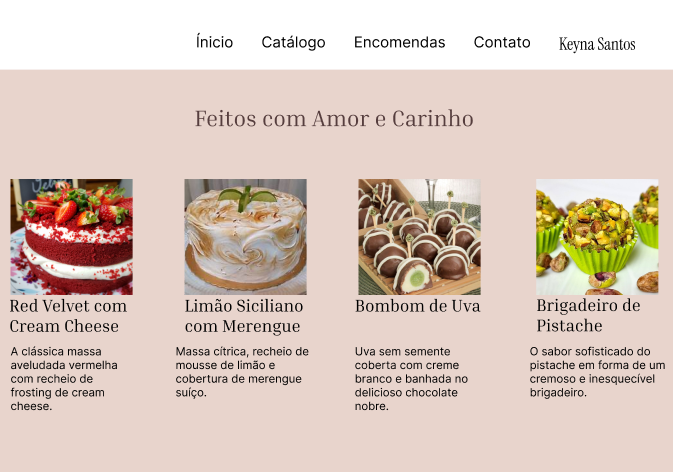

# Protótipos de Interface

Nesta seção, apresentamos a evolução do design da interface, desde os conceitos estruturais iniciais até o protótipo de alta fidelidade desenvolvido no Figma.

---

## 1. Protótipo de Baixa Fidelidade (Wireframes)

A fase de prototipação de baixa fidelidade consistiu em uma série de rascunhos rápidos e discussões de layout para definir a estrutura fundamental do site. Para agilizar o processo e validar a direção visual da marca de forma mais eficaz com a cliente, a equipe optou por evoluir esses rascunhos diretamente para um conceito visual de alta fidelidade.

A imagem abaixo representa a primeira versão de alta fidelidade da tela de entrada, que serviu como base para o desenvolvimento do restante da identidade visual e validação do conceito com a cliente.

### Tela: Catálogo de Produtos
* **(IMAGEM DO SEU WIREFRAME DO CATÁLOGO AQUI)**
* **Descrição:** A página do catálogo apresenta os produtos em um formato de grade para facilitar a visualização. Incluímos uma barra lateral com filtros de categoria para que o usuário encontre o que deseja rapidamente.

### Tela: Formulário de Encomendas
* **(IMAGEM DO SEU WIREFRAME DO FORMULÁRIO AQUI)**
* **Descrição:** O formulário foi projetado para ser simples e direto, coletando todas as informações essenciais para a encomenda (nome, contato, detalhes do pedido, data) de forma organizada.

## 2. Protótipo de Alta Fidelidade (Hi-Fi)

Após a validação da estrutura com os wireframes, avançamos para o protótipo de alta fidelidade. Nesta fase, aplicamos a identidade visual da marca, incluindo cores, tipografia e imagens, para criar uma representação fiel da experiência final do usuário no site da Confeitaria Kenya Santos.

### Decisões de Estilo Visual (UI - User Interface)

* **Paleta de Cores:** A paleta foi escolhida para transmitir sofisticação, confiança e uma sensação "saborosa". Utilizamos tons de marrom e rosa, remetendo ao chocolate e aos doces, combinados com um fundo bege claro para trazer elegância e destacar as fotos dos produtos.
* **Tipografia:** Para os títulos, escolhemos a fonte "Playfair Display", uma fonte serifada que confere um ar de requinte. Para os textos corridos e descrições, utilizamos a "Montserrat", uma fonte sans-serif moderna e de alta legibilidade em telas digitais.
* **Imagens e Estilo Visual:** A direção de arte para as imagens prioriza fotos profissionais, bem iluminadas e que realçam a textura e a beleza dos produtos, com o objetivo de despertar o desejo no cliente.
* **Componentes e Ícones:** Foi criado um sistema de design consistente para botões, campos de formulário e ícones, garantindo uma experiência de usuário coesa e intuitiva em todas as páginas.

### Tela: Página Inicial (Alta Fidelidade)

* **Descrição:** Esta versão da página inicial de alta fidelidade foi projetada para ser limpa, elegante e convidativa, com foco em apresentar os produtos e a essência da marca "Kenya Santos". A estrutura é composta por três áreas principais:
    * **Navegação Principal:** No topo, um cabeçalho minimalista oferece links claros e diretos para as seções essenciais do site ("Início", "Catálogo", "Encomendas", "Contato"), garantindo uma navegação fácil e intuitiva para o usuário.
    * **Título de Impacto:** A frase central "Feitos com Amor e Carinho" funciona como o principal slogan da página, comunicando o diferencial da marca: o cuidado, a qualidade e o toque artesanal de cada produto.
    * **Seção de Produtos em Destaque:** Logo abaixo, uma grade visual apresenta quatro dos principais produtos da confeitaria. Cada item é exibido com uma imagem profissional de alta qualidade, seu nome e uma breve descrição. O objetivo desta seção é despertar o interesse imediato do cliente e incentivá-lo a explorar o catálogo completo. A paleta de cores suaves (tons de bege e rosa) reforça a sensação de sofisticação e carinho da marca.

#### Tela: Catálogo de Produtos
* **(IMAGEM DO SEU PROTÓTIPO 'HI-FI' DO CATÁLOGO AQUI)**
* **Descrição:** A grade de produtos agora exibe as imagens reais, tornando o catálogo muito mais atraente. Os preços e nomes estão claramente legíveis. O filtro de categorias foi estilizado para ser discreto, mas funcional.

#### Tela: Formulário de Encomendas
* **(IMAGEM DO SEU PROTÓTIPO 'HI-FI' DO FORMULÁRIO AQUI)**
* **Descrição:** O formulário foi estilizado com cores suaves e campos bem definidos para não sobrecarregar o usuário. A tipografia garante que todos os rótulos sejam fáceis de ler, e o botão de envio se destaca para indicar claramente a ação final.

